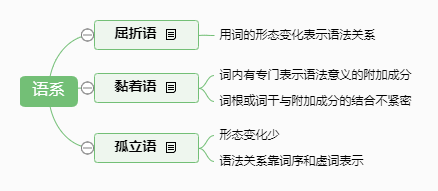
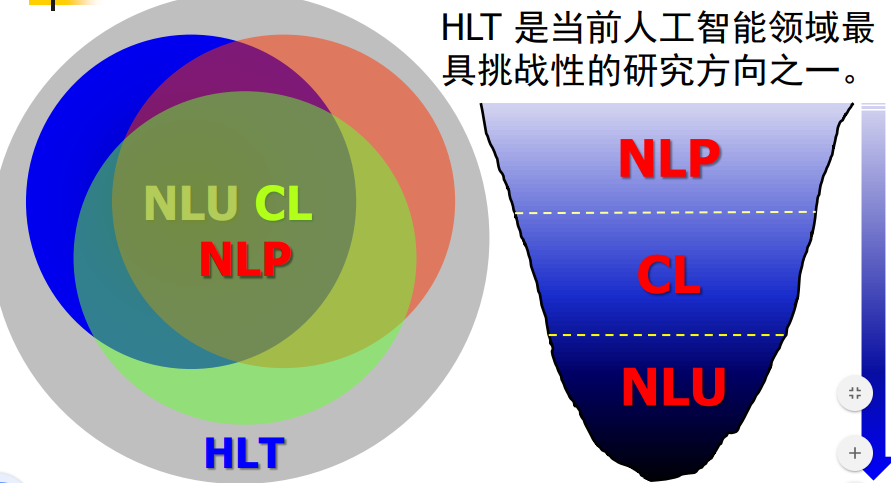
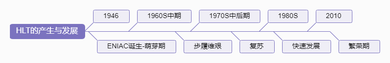
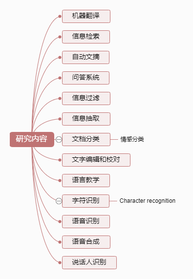
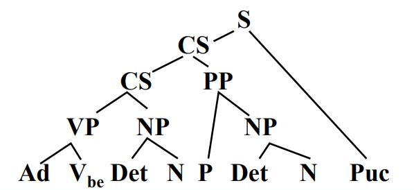
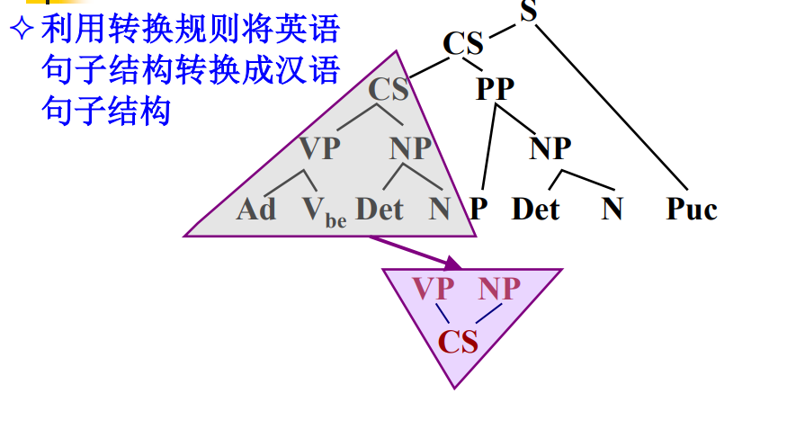
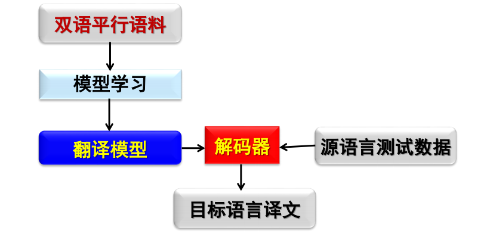
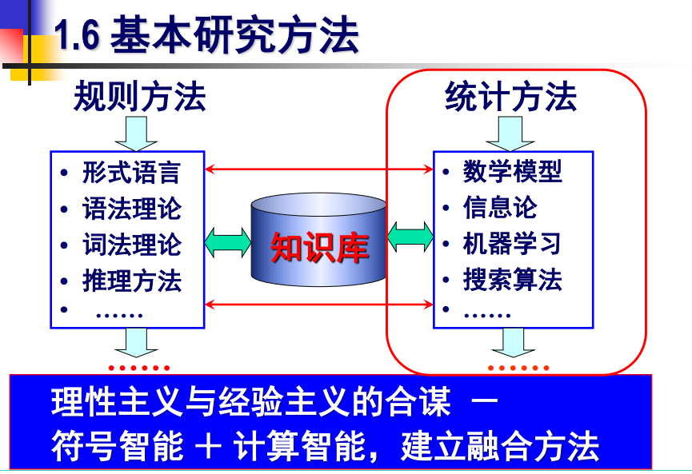
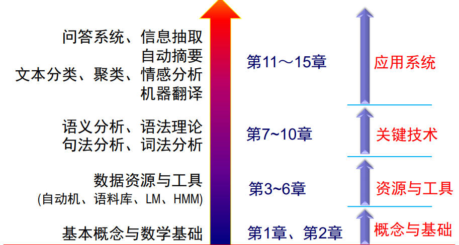

[TOC]

《自然语言处理 绪论 宗成庆》

# 1. 绪论

## 1.1. 问题的提出

- 语言的自由通讯在改变着人们的思维方式和生活方式
- 语言是思维的载体
- 人类历史上以语言文字形式记载和流传的知识占知识总量的 80％以上
- 中国互联网上有 87.8%的网页内容是文本表示的
- 面对文本大数据，我们面临怎样的机遇和挑战？

### 1.1.1. 市场前景

- 网络信息检索市场前景广阔

  - 全世界网页数量正在以指数速率增长
  - 中文网页的检索最高准确率不足 40%

- 机器翻译市场潜力巨大

- 信息安全问题已经成为国际社会共同关注的焦点
- 如何进行文本数据挖掘？
- 人工难以应对的数据“灾难”

### 1.1.2. 主要任务

- 如何让计算机理解人的意图和心声
- 如何让计算机实现文本挖掘，满足不同需求

## 1.2. 基本概念

### 1.2.1. 语言学 vs 语音学

#### 1.2.1.1. 语言学（Liguistics）

- 语言学是指对语言的科学研究；
- 研究语言的本质、结构和发展规律的科学
- 语音和文字是语言的两个基本属性

#### 1.2.1.2. 语音学（Phonetics）

研究人类发言特点，特别是语音发音特点，并提出各种语音描述、分类和撰写方法的科学

- 发音语音学
- 声学语音学
- 听觉语音学

### 1.2.2. NLP 和其他概念的比较

#### 1.2.2.1. CL 计算机语言学

通过建立形式化的计算模型来分析、理解和生成自然语言的学科，是人工智能和语言学的分支学科。

计算语言学是典型的交叉学科，其研究常常涉及**计算机科学**、**语言学**、**数学**等多个学科的知识。与内容接近的学科自然语言处理相比较，计算语言学更加侧重基础理论和方法的研究。

#### 1.2.2.2. NLU 自然语言理解（Natural Language Understanding）

自然语言理解是探索人类自身语言能力和语言思维活动的本质，研究模仿人类语言认知过程的自然语言处理方法和实现技术的一门学科。它是人工智能早期研究的领域之一，是一门在**语言学**、**计算机科学**、
**认知科学**、**信息论**和**数学**等多学科基础上形成的交叉学科。

#### 1.2.2.3. NLP 自然语言处理（Natural Language Processing）

自然语言处理是研究如何利用计算机技术对语言文本（句子、篇章或话语等）进行处理和加工的一门学科，研究内容包括对**词法**、**句法**、**语义**和**语用**等信息的识别、分类、提取、转换和生成等各种处理方法和实现技术。

### 1.2.3. 几个标准的概念

#### 1.2.3.1. 关于“理解”的标准

- 如何判断计算机系统的智能
  - 计算机系统的表现（act）如何？
  - 反映（react）如何？
  - 相互作用（interact）如何

与有一时的个体（人）比较如何

### 1.2.4. 不同的语系

- 屈折语(Fusional Language)
- 黏着语(Agglutinative Language)
- 孤立语(Analytic Language)

[语系脑图](./km/语系.km)

#### 1.2.4.1. 重要性

汉语已经不再是中国人自己使用和关注的语言，针对汉语的处理技术早已成为国际学术界和企业界共同关注的问题，汉英两大强势语言的自动翻译问题则是人类语言技术中最具挑战性的研究课题。

### 1.2.5. HLT 相关概念

- 人类语言技术（Human Language Technology，HLT）计算语言学也称自然语言处理或自然语言理解
  - 自然语言理解（Natural Language Understanding，NLU）
  - 计算语言学（Computational Linguistics，CL）
  - 自然语言处理（Natural Language Processing，NLP）

    

## 1.3. HLT 的产生与发展

[HTL 发展脑图](./km/HTL的产生与发展.km)

## 1.4. 研究内容

### 1.4.1. 按照应用目标划分

- 机器翻译（Machine translation，MT）

  - 应用：文献翻译、网页辅助浏览
  - 代表系统：谷歌、百度、Systran、有道

- 信息检索（Information Retrieval）

  - 代表系统：谷歌、百度

- 自动文摘（Automatic summarization / Automatic Abstracting)

  - 应用：电子图书管理、情报获取

- 问答系统（Question-answering system）

  - 代表系统：百度知道、IBM Watson

- 信息过滤（Information filtering）

- 信息抽取（Information extraction）

- 文档分类（Document Categorization）

  - 应用：图书管理、情报获取、网络内容监控

- 文字编辑和自动校对（Automatic profreading）

  - 应用：排版、印刷和书籍编纂

- 语言教学（Lanuage teaching）

- 文字识别（Character recognition）

- 语音识别（Automatic Speech recognition，ASR）

  - 应用：文字录入、人及通讯、语言翻译等
  - 困难：大量存在的同音词、近音词、集外词

- 文本转换/语音合成（text-to-speech synthesis）

  - 应用：朗读系统、人机语音接口等

- 说话人识别/认同/验证(Speaker recognition)
  - 应用：信息安全、防伪等等

### 1.4.2. 很多研究方向密切相关

    

## 1.5. 基本问题和主要困难

### 1.5.1. 基本问题

#### 1.5.1.1. 形态学问题（Morphology）

研究词（Word）由有意义的基本单位--词素（morphemes）的构成问题

#### 1.5.1.2. 句法问题（Syntax）

研究句子结构成分之间的相互关系和组成句子序列的规则

#### 1.5.1.3. 语义问题（Semantics）

研究如何从一个语句中词的意义，以及这些词在该语句中语法结构中的作用来推导该语句的意义

#### 1.5.1.4. 语用学问题（Pragmatics）

研究语义学未能涵盖的那些意义：为什么要说这句话

#### 1.5.1.5. 语音学问题（Phonetics）

研究语音特性、语音描述、分类与转写方法等

### 1.5.2. 主要困难

#### 1.5.2.1. 大量歧义现象（Ambiguity）

$C_{n}=\left(\begin{array}{c}{2 n} \\ {n}\end{array}\right) \frac{1}{n+1}$

##### 1.5.2.1.1. 词法歧义

##### 1.5.2.1.2. 词性歧义

##### 1.5.2.1.3. 结构歧义

##### 1.5.2.1.4. 语义歧义

##### 1.5.2.1.5. 语音歧义

##### 1.5.2.1.6. 多音字及韵律等歧义

#### 1.5.2.2. 大量未知语言现象

##### 1.5.2.2.1. 新词

##### 1.5.2.2.2. 新含义

##### 1.5.2.2.3. 新用法和新句型

### 1.5.3. 归纳起来

NLU 所面临的挑战：

- 普遍存在的不确定性
- 未知语言现象的不可预测性
- 始终面临的数据不充分性
- 语言知识表达的复杂性
- 机器翻译中映射单元的部队成型

人脑理解语言是一个复杂的思维过程

## 1.6. 基本研究方法

### 1.6.1. 理性主义

- 问题求解的基本思路：基于规则的分析方法建立符号 🔣 处理系统
  - 规则库开发：$N + N \rightarrow NP$
  - 词典标注：#工作; $N(uc)$; $V$;
  - 推导算法设计：归约、推导、歧义消解方法

$知识库+推理系统 \rightarrow NLP系统$

理论基础：Chomsky 的文法理论

### 1.6.2. 经验主义

偏重于对大规模语言数据中人们所实际使用的普通语句的统计

- 求解问题的思路：基于大规模真实语料（语言数据）建立计算方法
  - 大规模真实数据的收集、标注
  - 统计模型建立

$语料库 + 统计模型 \rightarrow NLP系统$

#### 1.6.2.1. 基于规则的方法

- 数据驱动的翻译方法（如 SMT 和 NMT）

#### 1.6.2.2. 基于统计的方法

- 给定源语言句子：$E=e_{1}^{m} \equiv e_{1} e_{2} \cdots e_{m}$

- 将其翻译成目标语言句子：$C=c_{1}^{l} \equiv c_{1} c_{2} \cdots c_{l}$

- 根据贝叶斯公式：
  $P(C | E)=\frac{P(C) P(E | C)}{P(E)}$

- $\hat{C}=\arg \max _{C} P(C) P(E | C)$

##### 1.6.2.2.1. 三个关键问题

- 估计语言模型概率$p(C);$
- 估计翻译模型概率$p(E | \mathbf{C})$
- 快速有效地搜索候选译文$C$，使$p(C) \times p(E | C)$

##### 1.6.2.2.2. 主要任务

- 收集大规模双语句子对、目标语言句子
- 参数训练与模型优化

#### 1.6.2.3. 两种方法相结合

## 1.7. 研究现状

- 各种理论问题
- 各种应用系统

### 1.7.1. 基本现状

- 部分问题得到了解决
- 基础问题研究任重道远：如语义表示和计算，高质量的自动翻译
- 社会需求日益迫切：信息服务、通讯、网络内容管理、情报处理、国家安全等
- 许多技术离真正使用还有相当距离，尚未建立其有效、完善的理论体系

## 1.8. 课程内容

### 1.8.1. 背景知识

- 概率论、信息论、建模方法基础
- 基本语言学知识
- 算法分析基础、编程能力

### 1.8.2. 目的

- 掌握自然语言理解的基本概念、理论、方法
- 掌握正确分析问题、解决问题的思维方式

### 1.8.3. 各章节内容

#### 1.8.3.1. 概念与基础

第一章 绪论
第二章 数学基础

#### 1.8.3.2. 资源与工具

第三章 形式语言与自动机
第四章 语料库语言学
第五章 语言模型
第六章 HMM 与 CRFs

#### 1.8.3.3. 关键技术

第七章 词法分析技术
第八章 句法理论
第九章 句法分析
第十章 语义分析

#### 1.8.3.4. 应用系统

第十一章 机器翻译
第十二章 文本分类、聚类
第十三章 文本自动摘要
第十四章 信息抽取
第十五章 问答系统

## 1.9. 参考文献

## 1.10. 本章小结

- 基本概念：NLU、NLP、计算语言学等
- 产生与发展
- 研究内容：机器翻译、信息检索…
- 基本问题：从词法、句法、语义到语用、语音
- 困难与挑战：歧义、未知现象 …
- 研究方法：经验主义方法与理性主义方法
