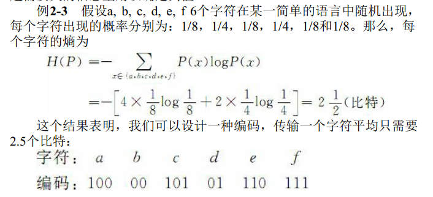
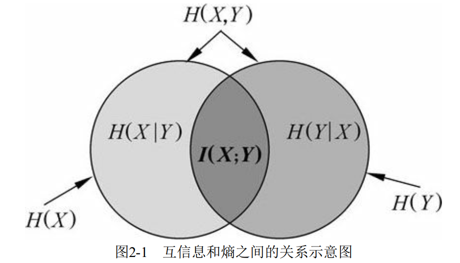
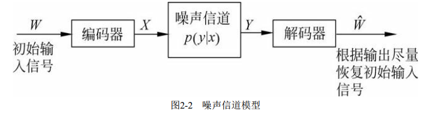
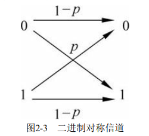
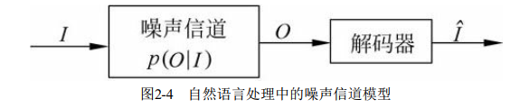
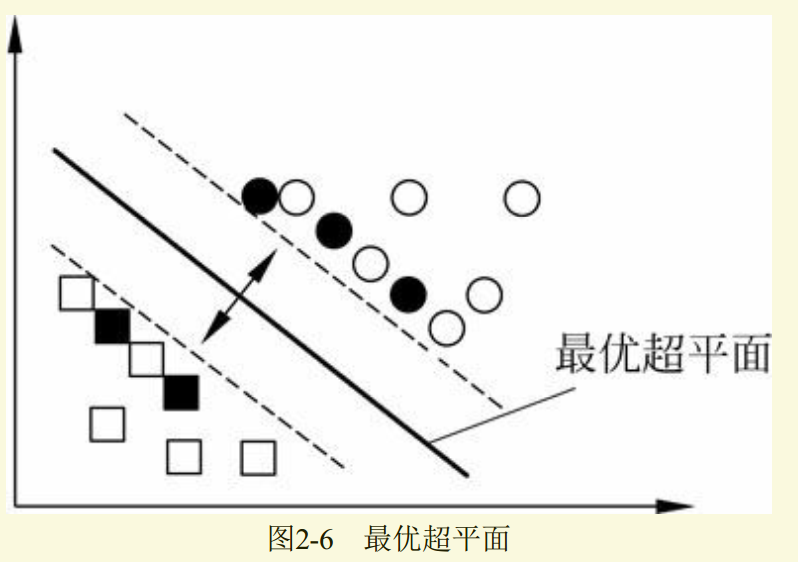

# 第2章 预备知识

## 2.1 概率论基本概念

### 2.1.1 概率
[详解最大似然估计（MLE）、最大后验概率估计（MAP），以及贝叶斯公式的理解](https://blog.csdn.net/u011508640/article/details/72815981)
概率（probability）是从随机试验中的时间到实数域的映射函数，用以表示时间发生的可能性。如果用
P(A)作为事件A的概率，Ω是试验的样本空间，则概率函数必须满足以下三条公理：

1. 非负性 $ P(A) ≥ 0 $
2. 规范性 $P(Ω) = 1$
3. 可列可加性 $P(\bigcup_{i=0}^\infty A_i)= \sum_{i=0}^\infty P(A_i)$

### 2.1.2 最大似然估计

&nbsp;&nbsp;&nbsp;&nbsp;&nbsp;&nbsp;&nbsp;如果${s_1, s_2,..., s_n}$是一个试验的样本空间，在相同的情况下重复试验N次，观察到样本$s_k(1≤k≤n)$的次数为$n_N(s_k)$，那么，$s_k$在这N次试验中的相对频率为
$$ q_N(s_k)=\frac{n_N(s_k)}{N} $$
由于$\sum_{k=1}^n n_N(s_k)=N$，因此$\sum_{k=1}^{n}q_N(s_k)=1$。
　　当N越来越大时，相对频率$q_N(s_k)$就越来越接近$s_k$的频率$P(s_k)$，事实上，
$$\lim_{N\rightarrow\infty} q_N(s_k)=P(s_k)$$
因此，通常用相对频率作为频率的估计值。这种估计概率值的方法称为最大似然估计。  
**----------------------PS:-----------------**  
**似然函数**  
　　似然(likelihood)这个词其实和概率(probability)是差不多的意思，Colins字典这么解释：The likelihood of something happening is how likely it is to happen. 你把likelihood换成probability，这解释也读得通。但是在统计里面，似然函数和概率函数却是两个不同的概念（其实也很相近就是了）。
对于这个函数：
$$P(x\mid \theta)$$  
　　输入有两个：x表示一个具体的数据；θ表示模型的参数。
如果θ是已知确定的，x是变量，这个函数叫做概率函数（probably function），它描述对于不同的样本点x，其出现概率是多少。
　　如果x是是已知确定的，θ是变量，这个函数叫做似然函数（likelihood function），它描述对于不同的模型参数，出现x这个样本点的概率是多少。
　　例如，$f(x,y)=x^y$, 即$x$的$y$次方。如果$x$是已知确定的(例如$x=2$)，这就是$f(y)=2^y$, 这是指数函数。 如果$x$是已知确定的(例如$y=2$)，这就是$f(x)=x^2$，这是二次函数。同一个数学形式，从不同的变量角度观察，可以有不同的名字。  

### 2.1.4 贝叶斯法则
**贝叶斯公式** [(参考博客)](http://www.xuyankun.cn/2017/05/13/bayes/)  
举例：  
　　一种癌症，得了这个癌症的人被检测出为阳性的几率为90%，未得这种癌症的人被检测出阴性的几率为90%，而人群中得这种癌症的几率为1%，一个人被检测出阳性，问这个人得癌症的几率为多少？  
我们用$A$表示事件“测出为阳性”，用$B_1$表示“得癌症”，$B_2$表示“未得癌症”。根据题目，我们知道如下信息：  
$$P(A\mid B_1)=0.9$$  
$$P(A\mid B_2)=0.1$$  
$$P(B_1)=0.01$$  
$$P(B_2)=0.99$$  
那么我们现在想要知道的是，已知为阳性的情况下，得癌症的几率$P(B_1|A)$。  
首先看一个概率：
$$P(B_1,A)=P(B_1)\cdot P(A\mid B_1) = 0.01\times 0.9=0.009  $$
这里$P(B_1,A)$表示的是联合概率，得癌症且检测出阳性的概率是人群中得癌症的概率乘上得癌症时测出是阳性的几率，是0.009。同理可得，未得癌症且检测出阳性的概率是：
$$P(B_2,A)=P(B_2)\cdot P(A\mid B_2) = 0.99\times 0.1=0.099  $$
这个概率概率是什么意思呢？就是说如果有1000个人，检测出阳性且得癌症的人有9人，检测出阳性但是未得癌症的有99人。可见这种仪器检测出癌症不可怕，不得癌症的是绝大多数的。  
那么在检测出阳性的前提下得癌症的概率应该怎么计算呢？  
很简单，就是看被测出为阳性的这108（99+9）人中，9人和99人分别占的比例就是我们要的。也就是说我们只需要添加一个归一化因子（normalization）就可以了。所以检测出阳性得癌症的概率$P(B_1\mid A)$为$\frac{0.009}{0.009+0.099}\approx0.083$，检测出阳性未得癌症的概率为：$P(B_2\mid A)=\frac{0.099}{0.009+0.099}\approx0.917$。  
这里$P(B_1\mid A)$和$P(B_2\mid A)$中间多了一条竖线$\mid$成为了条件概率，而这个概率就是贝叶斯统计中的**后验概率**。而人群中患癌症与否的概率$P(B_1)，P(B_2)$就是**先验概率**，根据观测值(observation)，也可以称为test evidence：是否为阳性，来判断患癌症的后验概率，这就是基本的贝叶斯思想，现在我们就可以得到本题中的后验概率公式为：  
$$P(B_i\mid A)=\frac{P(B_i)\cdot P(A\mid B_i)}{P(B_1)\cdot P(A\mid B_1)+P(B_2)\cdot P(A\mid B_2)}$$

由此可得到如下的贝叶斯公式的一般形式。  
把上面癌症例题中的A变成样本（sample）$x$，把B变成参数(parameter)$\theta$，我们便得到贝叶斯公式：
$$\pi(\theta_i\mid x) = \frac{f(x\mid\theta_i)\pi(\theta_i)}{\sum_if(x\mid\theta_i)\pi(\theta_i)}$$
可以看出上面这个例子中，$B$事件的分布是离散的，所以在分母用的是求和符号$\sum$。那么如果我们的参数$\theta$的分布是连续的呢？没错，那就要用积分，于是我们得到了真正的**贝叶斯公式**：
$$\pi(\theta\mid x) = \frac{f(x\mid\theta)\pi(\theta_i)}{\int_\Theta f(x\mid\theta_i)\pi(\theta)d\theta}$$
其中$\pi$值得是参数的概率分布，$\pi(\theta)$指的是先验概率，$\pi(\theta\mid x)$指的是后验概率，$f(x\mid\theta)$指的是我们观测到的样本的分布，也就是**似然函数**(likelihood)。记住**竖线$\mid$左边的才是我们需要的**。其中积分求的区间$\Theta$指的是参数$\theta$所有可能取到的值的域，所以可以看出后验概率$\pi(\theta\mid x)$是在知道$x$的前提先在$\Theta$域内的一个关于$\theta$的概率密度分布，每一个$\theta$都有一个对应的可能性（也就是概率）

### 2.1.8 贝叶斯决策理论  
&emsp;&emsp;贝叶斯决策理论（Bayesian decision theory）是统计方法处理模式分类问题的基本理论之一。假设研究的分类问题有c个类别，各类别的状态用$w_i$表示，$i=1,2,\dots,c$；对应于各个类别$w_i$出现的先验概率为$P(w_i)$；在特征空间已经观察到某一向量$x$，$x=[x_i, x_2, \dots, x_d]^T$是$d$维空间上的某一点，且条件概率密度函数$p(x\mid w_i)$是已知的。那么，利用贝叶斯公式我们可以得到后延概率$P(w_i\mid x)$如下：  
$$P(w_i\mid x) = \frac{p(x\mid w_i)P(w_i)}{\sum_{j=1}^{c}p(x\mid w_j)P(w_i)}$$
基于最小错误率的贝叶斯决策规则为：
如果$P(w_i\mid x) = \max_{j=1,2,,c}P(w_j\mid x)$，那么,$x\in w_i$。  
&emsp;&emsp;如果类别只有两类时，即$c=2$，则有：  
如果$l(x) = \frac{p(x\mid w_1)}{p(x\mid w_2)}>\frac{P(w_2)}{P(w_1)}$，则$x\in w_i$，否则$x\in w_2$。其中$l(x)$为似然比，而$\frac{P(w_2)}{P(w_1)}$成为似然比阈值。

## 2.2 信息论基本概念
[参考博客：交叉熵与机器学习](https://blog.csdn.net/tsyccnh/article/details/79163834)
### 2.2.1 熵
&emsp;&emsp;如果$X$是一个离散型随机变量，取值空间为$R$，其概率分布为$p(x)=P(X=x)$，$x\in R$。那么X的熵$H(X)$定义为：  
$$H(X)=-\sum_{x\in R}p(x)log_2p(x)$$
其中，约定$0log)=0$。$H(X)$可以写为$H(p)$。由于在公式中对数以$2$为底，该公式定义的熵的单位为二进制位（比特）。通常将$log_2p(x)$简写成$logp(x)$。
&emsp;&emsp;熵又称为自信息(self-information)，可以视为描述一个随机变量的不确定性的数量。它表示信源$X$每发一个符号（不论发什么符号）所提供的平均信息量。一个随机变量的熵越大，它的不确定性越大，那么，正确估计其值的可能性就越小。越不确定的随机变量越需要大的信息量用以确定其值。  

||
|:-:|

若图中例子的$a,b,c,d,e,f$对应的概率为:
字母|a|b|c|d|e|f
-|-|-|-|-|-|--
概率 | $\frac{1}{2}$ | $\frac{1}{4}$ | $\frac{1}{16}$ | $\frac{1}{16}$ | $\frac{1}{16}$ | $\frac{1}{16}$
&emsp;&emsp;可以发现，相对于例题中的概率分布，“不确定性”减弱了，因为概率分步不那么平均了，有了明显的倾斜。计算此种情况的熵：
$$\begin{aligned}
    H(P)=&-\sum_{x\in {a,b,c,d,e,f}}P(x)logP(x)\\
    =&-[4\times \frac{1}{16}log\frac{1}{16}+\frac{1}{4}log\frac{1}{4}+\frac{1}{2}log\frac{1}{2}]\\
    =& 2
\end{aligned}$$
可见，熵值也降低了。符合上述论述

&emsp;&emsp;在只掌握关于未知分布的部分知识情况下，符合已知知识的概率分步可能有多个，但使熵值最大的概率分步最真实地反映了时间的分步情况，因为熵定义了随机变量的不确定性，当熵最大时，随机变量最不确定，最难准确地预测其行为。也就是说，在已知部分知识的前提下，关于未知分布最合理的推断应该是符合已知知识最不确定或最大随机的推断。  

PS：最大熵模型 https://transwarpio.github.io/teaching_ml/2017/08/15/最大熵模型/   

### 2.2.2 联合熵和条件熵
如果$X,Y$是一对离散型随机变量$X,Y~p(x,y)$，$X,Y$的联合熵(joint entropy)$H(X,Y)$定义为

$$
H(X,Y)=-\sum_{x\in X}\sum_{y\in Y}p(x,y)logp(x,y)\tag{a}
$$
联合熵实际上就是描述一对随机变量平均所需要的信息量。  
&emsp;&emsp;给定随机变量$X$的情况下，随机变量$Y$的条件熵(conditional entropy)由下式定义：  
$$
\begin{aligned}
H(Y\mid X)=&\sum_{x\in X}p(x)H(Y\mid X=x)\\
=&\sum_{x\in X}p(x)[-\sum_{y\in Y}p(y\mid x)logp(y\mid x)]\\
=&-\sum_{x\in X}\sum_{y\in Y}p(x,y)logp(y\mid x)    
\end{aligned}\tag{b}
$$
将式(a)中的联合概率$logp(x,y)$展开，可得  
$$
\begin{aligned}
H(X,Y)=&-\sum_{x\in X}\sum_{y\in Y}p(x,y)log[p(x)p(y\mid x)]\\
=&-\sum_{x\in X}\sum_{y\in Y}p(x,y)[logp(x) + logp(y\mid x)]\\
=&-\sum_{x\in X}\sum_{y\in Y}p(x,y)logp(x)-\sum_{x\in X}\sum_{y\in Y}p(x,y)logp(y\mid x)\\
=&\sum_{x\in X}p(x)logp(x0 -\sum_{x\in X}\sum_{y\in Y}p(x,y)logp(y\mid x)\\
=&H(X) + H(Y\mid X)
\end{aligned}\tag{c}
$$
我们称式(c)为熵的连锁规则。推广到一般情况，有：
$$
H(X_1,X_2,\dots,X_n)=H(X_1)+H(X_2\mid X_1)+\dots +H(X_n\mid X_1,\cdots,X_{n-1})
$$

&emsp;&emsp;一般的，对于一条长度为n的信息，每一个字符或字的熵为
$$H_{rate}=\frac{1}{n}H(X_{1n})=-\frac{1}{n}\sum_{x_{1n}}p(x_{1n})logp(x_{1n})$$
这个数值称为熵率（entropy rate）。其中，变量$X_{1n}$表示随机变量序列$(X_1, X_2, \dots ,X_n)$，$x_{1n}=(x_1, x_2, \dots , x_n)$。

### 2.2.3 互信息
&emsp;&emsp;根据上的连锁规则，有
$$H(X,Y)=H(X)+H(Y\mid X)=H(Y)+H(X\mid Y)$$
因此，
$$H(X)-H(X\mid Y)=H(Y)-H(Y\mid X)$$
这个差叫做$X$和$Y$的互信息(mutual information, MI)，记做$I(X;Y)$，或者定义为：如果$(X,Y)$~$p(x,y)$，则$X,Y$之间的互信息$I(X;Y)=H(X)-H(X\mid Y)$。  
&emsp;&emsp;$I(X;Y)$反映的是在知道了$Y$的值以后$X$的不确定性的减少量。可以理解为$Y$的值透露了多少关于$X$的信息量。
&emsp;&emsp;互信息和熵之间的关系可以用如下图表示：  
||
|:-:|
&emsp;&emsp;如果将定义中的$H(X)$和$H(X\mid Y)$展开，可得：
$$\begin{aligned}
    I(X;Y)=&H(X) - H(X\mid Y)\\
    =&H(X)+H(Y)-H(X,Y)\\
    =&\sum_x p(x)log\frac{1}{p(x)}+\sum_yp(y)log\frac{1}{p(y)}+\sum_{x,y}p(x,y)logp(x,y)\\
    =&\sum_{x,y}log\frac{p(x,y)}{p(x)p(y)}
\end{aligned}
$$
由于$H(X\mid X)=0$，因此，
$$H(X)=H(X)-H(X\mid X)=I(X;X)$$
&emsp;&emsp;这一方面说明了为什么熵又称为自信息，另一方面说明了两个完全相互依赖的变量之间的互信息并不是一个常量，而是取决于他们的熵。
&emsp;&emsp;实际上，互信息体现了两变量之间的依赖程度：如果$I(X;Y)\gg 0$，表明$X$和$Y$是高度相关的；如果$I(X;Y)= 0$，表明$X$和$Y$是相互独立的；如果$I(X;Y)\ll 0$，表明$Y$的出现不但未是$X$的不确定性减小，反而增大了$X$的不确定性，常是不利的。平均互信息量是非负的。
&emsp;&emsp;同样，我们可以推导出条件互信息以及互信息的连锁规则：
$$I(X;Y\mid Z)=I((X;Y)\mid Z)=H(X\mid Z) - H(X\mid Y,Z)$$
$$
\begin{aligned}
    I(X_{1n};Y)=&I(X_1,Y)+\dots +I(X_n;Y\mid X_1,\dots,X_{n-1})\\
    =&\sum_{i=1}^{n}I(X_i;Y\mid X_1,\dots,X_{i-1})
\end{aligned}
$$
### 2.2.4 相对熵
&emsp;&emsp;相对熵(relative entropy)又称Kullback-Leibler差异，或简称KL距离，是衡量相同事件空间里两个概率分步相对差距的测度。两个概率分步$p(x)$和$q(x)$的相对熵定义为：
$$
    D(p\parallel q) = \sum_{x\in X}p(x)log\frac{p(x)}{q(x)}    
$$
&emsp;&emsp;该定义中约定$0log(\frac{0}{q}=0，plog(\frac{p}{0})=\infty$。表示成期望值为：
$$
    D(p\parallel q)=E_p(log\frac{p(X)}{q(X)})
$$
&emsp;&emsp;显然，当两个随机分布完全相同时，即$p=q$，其相对熵为0，。当两个随机分布的差别增加时，其相对熵期望值也增大。
&emsp;&emsp;互信息实际上就是衡量一个联合分布于独立性差距多大的测度：
$$I(X;Y)=D(p(x,y)\parallel p(x)p(y)$$
### 2.2.5 交叉熵
&emsp;&emsp;根据前面熵的定义，知道熵是一个不确定性的测度，也就是说，我们对于某件事情知道的越多，那么熵就越小，因而对于试验的结果我们越不感到意外。交叉熵的概念就是用来衡量估计模型与真实概率分步之间的差异情况的。
&emsp;&emsp;如果一个随机变量$X$~$p(x)$，$q(x)$为用于近似$p(x)$的概率分步，那么，随机变量$X$和模型$q$之间的交叉熵定义为：
$$
\begin{aligned}
    H(X,q)=&H(X)+D(p\parallelq)\\
    =&-\sum_xp(x)logq(x)\\
    =&E_p(log\frac{1}{a(x)})
\end{aligned}
$$
&emsp;&emsp;由此，可以定义语音$L=(X_i)$~$p(x)$与其模型$q$的交叉熵为：
$$H(L,q)=-\lim_{n\rightarrow \infty}\frac{1}{n}\sum_{x_{1}^{n}}p(x_{1}^{n})logq(x_{1}^{n})$$
其中，$x_{1}^{n}=x_1,x_2,\dots,x_n$为$L$的语句，$p(x_{1}^{n})$为$L$中$x_{1}^{n}$的概率，$q(x_{1}^{n})$为模型$q$对$x_{1}^{n}$的概率估计。至此，仍然无法计算这个语言的交叉熵，因为我们并不知道真实概率$p(x_{1}^{n})$，不过可以假设这种语言是“理想”的，即$n$趋于无穷大时，其全部“单词”的概率和为1。也就是说，根据信息论的定理：假定语言$L$是稳态遍历的随机过程，$L$与其模型$q$的交叉熵计算公式就变为：
$$H(L,q)=-\lim_{n\rightarrow \infty}\frac{1}{n}logq(x_{1}^{n})$$
由此，可以根据模型$q$和一个含有大量数据的$L$的样本来计算交叉熵。在设计模型$q$时，目的是使交叉熵最小，从而使模型最接近真实的概率分布$p(x)$。一般地，在$n$足够大时我们近似地采用如下计算方法：
$$H(L,q)\approx -\frac{1}{n}logq(x_{1}^{n})$$
交叉熵与模型在测试语料中分配给每个单词的平均概率所表达的含义正好相反，模型的交叉熵越小，模型的表现越好。
### 2.2.6 困惑度
&emsp;&emsp;在设计语言模型时，我们通常用困惑度（perplexity）来代替交叉熵衡量语言模型的好坏。给定语言$L$的样本$l_{1}^{n}=l_1\dots l_n$，$L$的困惑度$PP_q$定义为：
$$PP_q=2^{H(L,q)}\approx2^{-\frac{1}{n}logq(l_{1}^{n})}=[q(l_{1}^{n})]^{-\frac{1}{n}}$$
&emsp;&emsp;同样，语言模型设计的任务就是寻找困惑度最小的模型，使其最接近真实语言的情况。
&emsp;&emsp;在NLP中，困惑度通常$\rightarrow$语言模型对于测试数据的困惑度。
### 2.2.7 噪声信道模型
&emsp;&emsp;信息熵可以定量地估计信源每发送一个符号所提供的平均信息量  
&emsp;&emsp;通信系统最根本的问题在于如何定量地估算从信道输出中获取多少信息量。  
&emsp;&emsp;香农为了模型化信道的通信问题，在熵这一概念的基础上提出了噪声信道模型，其目标就是优化噪声信道中信号传输的吞吐量和准确率，其基本假设是一个信道的输出以一定的概率依赖于输入。  
&emsp;&emsp;一般情况下，在信号传输过程中都要进行双重性处理：一方面要对编码进行压缩，尽量消除所有的冗余；另一方面又要通过增加一定的可控冗余以保障输入信号经过噪声信道传输以后可以很好的恢复原状。这样，信息编码时要尽量少占用空间，但又必须保持足够的冗余以便能够检测和校验传输造成的错误。信道输出信号解码后应该尽量恢复到原始输入状态。过程可有下图表示：  

||
|:-:|

&emsp;&emsp;一个二进制对称信道的输入符号集为$X={0,1}$，输出符号集为$Y={0,1}$。在传输过程中如果输入符号被误传的概率为$p$，则被正确传输的概率就是$1-p$。可由下图表示：  
||
|:-:|
&emsp;&emsp;信息论中另一个重要概念是信道容量，其基本思想是用降低传输速率来换取高保真通信的可能性。其定义可以根据互信息给出：
$$C=\max_{p(X)}I(X;Y)$$
&emsp;&emsp;根据这个定义，如果能够设计一个输入编码$X$，其概率分布为$p(X)$，使其输入与输出之间的互信息达到最大值，那么，我们的设计就达到了信道的最大传输容量。从数学上讲，上式所表示的信道容量C就是平均互信息量的最大值。  
&emsp;&emsp;在自然语言处理中不需要进行编码，一种自然语言的句子即可视为已编码的符号序列，但需要进行解码，使观察到的输出序列更接近于输入。因此，我们可以用下图来表示这个噪声信道模型。  
||
|:-:|
&emsp;&emsp;模拟信道模型，在NLP中，很多问题都可以归结为在给定输出$O$（可能含有误传信息）的情况下，如何从所有可能的输入$I$中求解最有可能的那个，即求出使$p(I\mid O)$最大的$I$作为输入$\hat{I}$。根据贝叶斯公式，有
$$
\begin{aligned}
    \hat{I}=&\argmax_Ip(I\mid O)\\
    =&\argmax\frac{p(I)p(O\mid I)}{p(O)}\\
    =&\argmax_Ip(I)p(O\mid I)
\end{aligned}
$$
上式中有两个概率分布需要考虑 ，一个是$p(I)$，称为语言模型(language model)，是指在输入语言中“词”序列的概率分布；另一个是$p(O\mid  I)$，称为信道概率（channel probability)。  
&emsp;&emsp;举例而言，如果想把一个法语句子$f$翻译成英语$e$，那么，相应的翻译信道模型就是假定法语句子$f$作为信道模型的输出，它原本是一个英语句子$e$，但通过噪声通道传输时被改变成了法语句子$f$。那么，现在需要做的就是如何根据概率$p(e)$和$p(f\mid e$的计算求出最接近原始英文句子$e$的解$\hat{e}$，或者说如何对给定的法语句子$f$进行解码以得到最有可能的句子$\hat{e}$。
## 2.3 支持向量机
### 2.3.1 线性分类
&emsp;&emsp;两类问题（正类和负类）的分类通常用一个实数函数$f:X\subseteq R^n\rightarrow R$($n$为输入维数，$R$为实数)，通过执行如下操作进行：当$f(x)\geq0$时，将输入$x=(x_1,x_2,,\dots,x_n$赋予正类，否则，将其赋予负类。当$f(x)(x\in X)$是线性函数时，$f(x)$可以写成如下形式：
$$
\begin{aligned}
    f(x)=&(\pmb {w\cdot x})+b\\
    =&\sum_{i=1}^{n}w_ix_i+b
\end{aligned}$$
其中，$(w,b)\in R^n\times R$是控制函数的参数，决策规则由函数$sgn(f(x))$给出，通常$sgn(0)=1$。参数学习意味着要从训练数据中获得这些参数，“$\cdot$”是向量点积。  
&emsp;&emsp;该分类方法的几何解释是，方程式$(\pmb(w\cdot x))+b=0$定义的超平面将输入空间$X$分成两半，一半为负类，一半为正类，如下图所示：  
|.png)|
|:-:|
&emsp;&emsp;图中的黑斜线表示超平面，对应地，超平面上面为正区域，用符号“+”表示，下面为负区域，用符号“-”表示。$w$是超平面的法线方向。当$b$的值变化时，超平面平行移动。因此，如果想表达$R^n$中所有可能的超平面，一般要包括$b+1$个可调参数的表达式。
&emsp;&emsp;如果训练数据可以被无误差地划分，那么，以最大间隔分开数据的超平面称为最优超平面，如下图：
||
|:-:|  
&emsp;&emsp;对于多分类问题，输出域是$Y={1,2,\dots,m}$。线性学习器推广到$m(m\in N,m\geq 2)$类是很直接的：对于$m$类中的每一类关联一个权重向量$w_i$和偏移量$b_i$，即$(w_i,b_i), i\in {1,2,\dots,m}$，给出如下决策函数：
$$c(\pmb x)=\argmax_{1\leq i\leq m}(\pmb{w\cdot x}+b_i)$$
其几何意义是：给每个类关联一个超平面，然后，将新点$x$赋予超平面离其最远的那一类。输入空间分为$m$个简单相连的凸区域。  
### 2.3.2 线性不可分
&emsp;&emsp;对于非线性问题，可以把样本x映射到某个高维特征空间，在高维特征空间中使用线性学习器。因此，假设集是如下类型的函数：
$$f(x）=\sum_{i=1}^N \pmb {w_i}\phi $$
