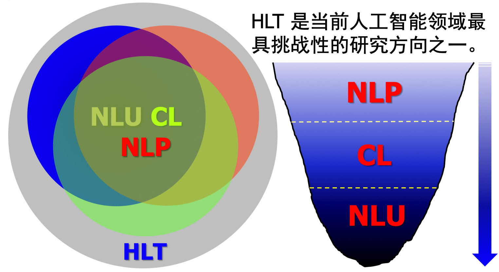
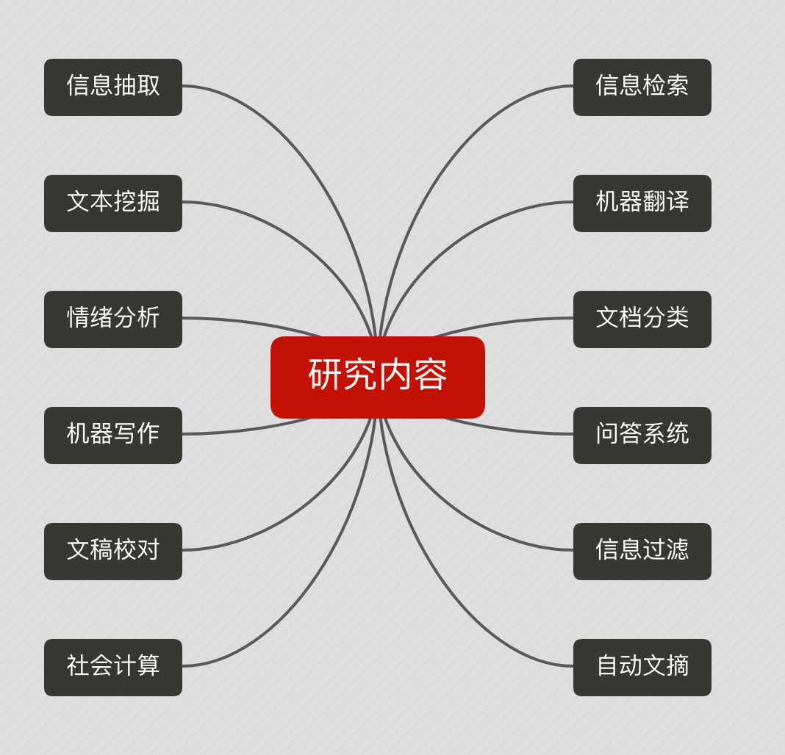
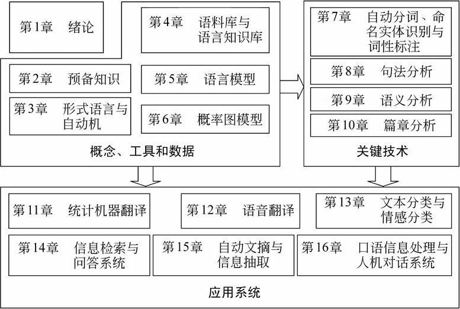

## 1.1问题提出
​	语言文字是承载人类语言的主要形式，约占总量的**80%**以上。

​	且当前互联网上87.8%内容为文本。

​	随着移动互联网及大数据的爆发，网页产生速度也将呈现于幂指数级别暴涨。

​	但目前在自然语言处理技术上却没能跟上，中文检索率不足40%。

​	因此在当前进行NLP的学习是非常好的时机。如何让计算机自动/半自动实现海量文本的自动处理，挖掘和有效利用，理解自然语言文本，满足用户需求。

## 1.2基本概念及关系

人类语言技术([Human Language Technology](https://www.wikiwand.com/en/Language_technology)，HLT)

​	研究计算机如何处理，分析，生产，修改自然人的文本和语音的技术。

​	在概念上除了包括NLP，CL，NLU外，还包括语音领域的问题。

自然语言理解(natural language understanding, NLU)

​	自然语言理解是探索人类自身语言能力和语言思 维活动的本质，研究模仿人类语言认知过程的自然语 言处理方法和实现技术的一门学科。它是人工智能早期研究的领域之一，是一门在语言学、计算机科学、 认知科学、信息论和数学等多学科基础上形成的交叉学科。

​	理解包括表现(act)，反应(react)，相互作用(interact)

计算语言学 (Computational Linguistics, CL) 

​	通过建立形式化的计算模型来分析、理解和生成 自然语言的学科，是人工智能和语言学的分支学科。 计算语言学是典型的交叉学科，其研究常常涉及计算 机科学、语言学、数学等多个学科的知识。与内容接 近的学科自然语言处理相比较，计算语言学更加侧重 基础理论和方法的研究。

自然语言处理 (Natural Language Processing, NLP)

​	自然语言处理是研究如何利用计算机技术对语 言文本(句子、篇章或话语等)进行处理和加工的 一门学科，研究内容包括对词法、句法、语义和语 用等信息的识别、分类、提取、转换和生成等各种 处理方法和实现技术。

自然语言生成(Natural-language generation，NLG) 

​	自然语言生成是自然语言处理的一部分，从知识库或逻辑形式等等机器表述系统去生成自然语言。

NLP = NLU + NLG

NLU：语音/文本  ->意思(meaning)

NLG：意思 ->语音/文本

## 1.4 研究内容

 ## 1.5 当前困难

归纳起来，NLU 所面临的挑战：

 普遍存在的不确定性：词法、句法、语义、语用 和语音各个层面

 未知语言现象的不可预测性：新的词汇、新的术 语、新的语义和语法无处不在

 始终面临的数据不充分性：有限的语言集合永远 无法涵盖开放的语言现象

 语言知识表达的复杂性：语义知识的模糊性和错 综复杂的关联性难以用常规方法有效地描述， 为 语义计算带来了极大的困难

### 1.5.1 形态学 (Morphology) 问题

研究词(word) 由有意义的基本单位－词素 (morphemes)的构成问题。

单词的识别/ 汉语的分词问题。

词素：词根、前缀、后缀、词尾

例如：人，蜈蚣；

老虎  老 ＋ 虎

图书馆  图 ＋ 书 ＋ 馆

re + ex + port  -> reexport

### 1.5.2 句法 (Syntax) 问题

研究句子结构成分之间的相互关系和组成句子 序列的规则 。

为什么一句话可以这么说也可以那么说？

如何建立快速有效的句子结构分析方法？

苹果，我吃了。与我吃了苹果。 不等于苹果吃了我。

### 1.5.3 语义 (Semantics) 问题

研究如何从一个语句中词的意义，以及这些词 在该语句中句法结构中的作用来推导出该语句的意 义。

这句话说了什么？比如：

​	(1) 苹果不吃了

​	(2) 这个人真牛

​	(3) 这个人眼下没些什么

​	(4) 火烧圆明园/火烧驴肉

### 1.5.4语用学(Pragmatics) 问题

研究在不同上下文中语句的应用，以及上下文 对语句理解所产生的影响。从狭隘的语言学观点看， 语用学处理的是语言结构中有形式体现的那些语境。 相反，语用学最宽泛的定义是研究语义学未能涵盖 的那些意义。

为什么要说这句话？比如：

​	（1）火，火！

​	（2）看看鱼怎么样了？

### 1.5.5 大量歧义(ambiguity)现象

#### 词法歧义

例如:

​	 (1) I’ll see Prof. Zhang home.

​	(2)自动化研究所取得的成就

​	自动化/研究所/取得/的/成就

​	自动化/研究/所/取得/的/成就

​	(3)门把手弄坏了

​	门/ 把/ 手/ 弄/ 坏/ 了	

​	门把手/ 弄/ 坏/ 了

#### 词性歧义

(1) Time flies like an arrow.

①动词：飞，飞翔，飞驰

②名词：苍蝇，飞虫

意思1：时间像箭一样飞驰（光阴似箭）。

意思2： 时间苍蝇喜欢箭（有一种苍蝇叫“时间”）。

(2) “动物保护警察”明年上岗(《环球时报》2010年9月25日，第10版)

中的保护修饰对象

#### 结构歧义

(1) 喜欢乡下的孩子。

(2) 关于鲁迅的文章。

(3) 今天中午吃**馒头**。 (4) 今天中午吃**食堂**。

(5) 今天中午吃**大碗**。(6) 今天中午吃了**闭门羹**。

(7) 写文章/ 写毛笔/ 写黑板

英语句子歧义组合的开塔兰数(Catalan Numbers)

$$
C_n = \left(\begin{array}{c}2n\\n\end{array}\right)\frac{1}{n+1}
\qquad  其中\left(\begin{array}{c}2n\\n\end{array}\right)=\frac{(2n)!}{n! * n!}\\n 为句子中介词短语的个数。
$$

## 1.6基本研究方法

### 1.6.1理想主义

通常通过一些特殊的语句或语言现象 的研究来得到对人的语言能力的认识，而这些语句 和语言现象在实际的应用中并不常见。

**问题求解的基本思路**：基于规则的分析方法建立

**符号处理系统**

​		规则库开发：N + N  ->NP

​		词典标注:  #工作，N(uc)；V；

​		推导算法设计：归约、推导、歧义消解方法…

知识库 ＋ 推理系统  - > NLP 系统

理论基础：Chomsky 的文法理论

### 1.6.2 经验主义

偏重于对大规模语言数据中人们所实

际使用的普通语句的统计。

**求解问题的思路：**基于大规模真实语料(语言数据)

**建立计算方法**

​		大规模真实数据的收集、标注：真实性、代表性、 标注信息 ……

​		统计模型建立：模型的复杂性、有效性、参数训 练方法 ……

语料库 ＋ 统计模型 ->NLP 系统

理论基础：统计学、信息论、机器学习

## 1.7课程安排

### 1.7.1 背景知识

 概率论、信息论、建模方法基础

 基本的语言学知识

 算法分析基础、编程能力

### 1.7.2 目的

 掌握自然语言理解的基本概念、理论、方法

 掌握正确分析问题、解决问题的思维方式

### 1.7.3 课程内容

