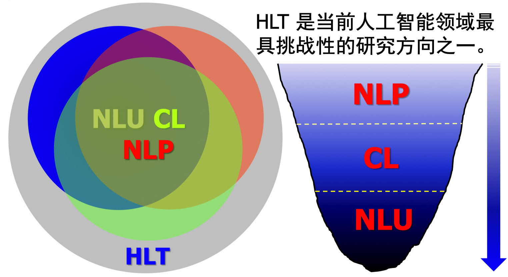
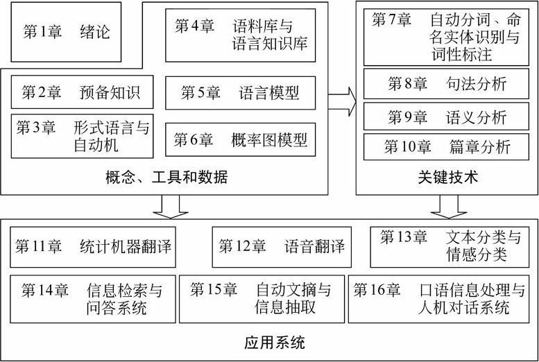

## 1.1问题提出
​	语言文字是承载人类语言的主要形式，约占总量的**80%**以上。

​	且当前互联网上87.8%内容为文本。

​	随着移动互联网及大数据的爆发，网页产生速度也将呈现于幂指数级别暴涨。

​	但目前在自然语言处理技术上却没能跟上，中文检索率不足40%。

​	因此在当前进行NLP的学习是非常好的时机。如何让计算机自动/半自动实现海量文本的自动处理，挖掘和有效利用，理解自然语言文本，满足用户需求。

## 1.2基本概念及关系

人类语言技术([Human Language Technology](https://www.wikiwand.com/en/Language_technology)，HLT)

​	研究计算机如何处理，分析，生产，修改自然人的文本和语音的技术。

​	在概念上除了包括NLP，CL，NLU外，还包括语音领域的问题。

自然语言理解(natural language understanding, NLU)

​	自然语言理解是探索人类自身语言能力和语言思 维活动的本质，研究模仿人类语言认知过程的自然语 言处理方法和实现技术的一门学科。它是人工智能早期研究的领域之一，是一门在语言学、计算机科学、 认知科学、信息论和数学等多学科基础上形成的交叉学科。

​	理解包括表现(act)，反应(react)，相互作用(interact)

计算语言学 (Computational Linguistics, CL) 

​	通过建立形式化的计算模型来分析、理解和生成 自然语言的学科，是人工智能和语言学的分支学科。 计算语言学是典型的交叉学科，其研究常常涉及计算 机科学、语言学、数学等多个学科的知识。与内容接 近的学科自然语言处理相比较，计算语言学更加侧重 基础理论和方法的研究。

自然语言处理 (Natural Language Processing, NLP)

​	自然语言处理是研究如何利用计算机技术对语 言文本(句子、篇章或话语等)进行处理和加工的 一门学科，研究内容包括对词法、句法、语义和语 用等信息的识别、分类、提取、转换和生成等各种 处理方法和实现技术。

自然语言生成(Natural-language generation，NLG) 

​	自然语言生成是自然语言处理的一部分，从知识库或逻辑形式等等机器表述系统去生成自然语言。

NLP = NLU + NLG

NLU：语音/文本  ->意思(meaning)

NLG：意思 ->语音/文本

## 1.4 研究内容

​	信息检索、机器翻译、文档分类、问答系统、信息过滤、自动文摘、信息抽取、文本挖掘、情绪分析、机器写作、文稿校对

 ## 1.5 当前困难

