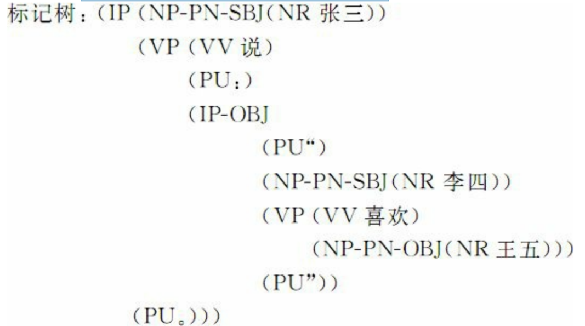

##LDC中文树库 

LDC中文树库（Chinese Tree Bank, CTB）是由美国宾夕法尼亚 大学（UPenn）负责开发，并通过语言数据联盟（LDC）发布的中文句法树库，该树库收集的语料取材于新华社和香港新闻等媒体，由2400个文本文件构成。含45000个句子， 110万个词，165万个汉字。文件由GBK和UTF-8两种编码格式存储。

### 在CTB中，汉语词性被划分为33类：

- 4类动词和谓语性形容词 （Verb, Adjective，分别记作： VC, VE, VV, VA）

* 3类名词（Noun，分 别记作：NR, NT, NN）
* 1类处所词（Localizer，记作：LC）
* 1类代词 （Pronoun, PN）
* 3类限定词和数词（Determiner and Number，分别记 作：DT, CD, OD）
* 1类量词（Measure word，记作：M）
* 1类副词 （Adverb，记作：AD）
* 1类介词（Preposition，记作：P）
* 2类连词 （Conjunction，分别记作：CC, CS）
* 8类语气词（Particle，分别记 作：DEC, DEG, DER, DEV, SP, AS, ETC, MSP）
* 8类包括外来词、标 点、感叹词等在内的其他词类（分别记作：IJ, ON, PU, JJ, FW, LB, SB, 

BA）

###CTB包括23类句法标记（syntactic tag）

* 17类短语：形容词 短语（adjective phrase, ADJP）
* 副词开头的副词短语（adverbial phrase headed by AD, ADVP）
* 量词短语（classifier phrase, CLP）
* 补语性嵌套句的从属连词引起的分句（clause headed by complementizer, CP）
* XP ＋DEG结构构成的短语（DNP）
* 限定词短语（determiner phrase, DP）
* XP＋DEV结构构成的短语（DVP）
* 片段语（fragment, FRAG）
* 简单分句（simple clause headed by INFL, IP）
* XP＋LC结构 构成的短语（LCP）
* 用于解释说明性的列表标记短语（list marker, LST）
* 名词短语（noun phrase, NP）
* 介词短语（preposition, PP）
* 插入语（parenthetical, PRN）
* 数量词短语（quantifier phrase, QP）
* 非 一致性并列短语（unidentical coordination phrase, UCP）
* 动词短语 （verb phrase, VP）。
* 另外，还有6个动词复合形式的标记（VCD, VCP, VNV, VPT, VRD, VSB）和一些句法结构成分标记，如：主语（-SBJ）、 谓语（-PRD）、宾语（-OBJ）等。另外，为了便于子树回溯，对一些 空类也给出了标记符号

举例说明：句子：张三说：“李四喜欢王五。

