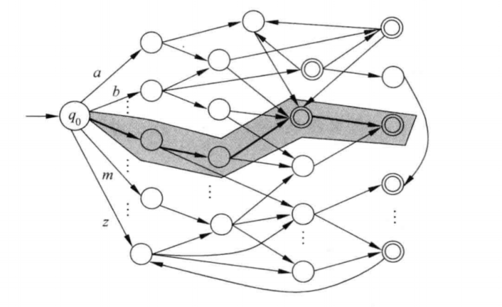
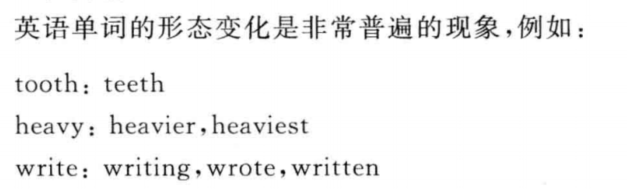
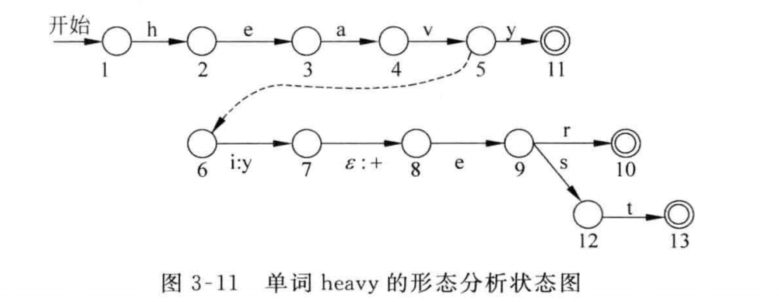

###自动机在自然语言处理中的应用：

#### 单词拼写检查

* 两个字符串的编辑距离等于是一个字符串变成另外一个字符串而进行的插入、删除、替换或者相邻字符交换位置而进行操作的最小次数
* 这个是面试nlp的常考题，leetcode求编辑距离，用于字符串相似度匹配，总的思想就是动态规划，一切看似无穷数据的题皆有规律，即动态规划
* 对于给定的字符串进行拼写检查的过程：实际上就是在给定阈值t (t>0)的范围内，寻找所有那些与输入串的编辑距离小于t的路径，这些路径从初始转态到终止状态经过的所有弧上的字母连接起来就是要找的与输入串最笑死的单词

​																拼写检查有限状态示意图

为了提高搜索速度，可以把搜索空间限定在一个较小的范围内，尽早把那些编辑距离超过给定阈值t的路径剪枝。为了判断哪些路径应该被剪枝，提出了剪除编辑距离或者剪除距离(cut-off edit distance)的概念，用以度量错误的输入串的字串与候选正确串之间的最小编辑距离

* 设X是出错的输入串，长度为m
* Y是一局部候选串（拼写正确），其长度为n
* l = max(1,n-t)
* u=min(m,n+t)
* 剪除距离: cuted(X[m],Y[n]) = min ed(X[i],Y[n])

举例子

$t=2, X=$ reprter $(m=7), Y=\operatorname{repo}(n=4)$

那么

$l=\max \{1,2\}=2, u=\min \{7,6\}=6$

$\begin{aligned} \text { cuted }(\text { reprter }, \text { repo })=& \min \{\text { ed }(\text { re }, \text { repo })=2\\ & \text { ed }(\text { rep }, \text { repo })=1 \\ & \text { ed }(\text { repr, repo })=1 \\ & \text { ed }(\text { reprt, repo })=2 \\ &\text { ed }(\text { reprte, repo })=3\}=1 \end{aligned}$ 

#### 单词形态分析

* 在实际应用中，除了有限状态机外，常常使用有限转态转换机(finite state transducer,FST)的概念。简单的讲，有限状态转换机与有限自动机或者有限状态机的区别在于：FST在完成状态转移的同时产生一个输出，而FA或者FSM只实现状态的转移，不产生任何输出

  

  

  形容词heavy在英文句子中可能以三种不同的形式出现：原型、比较级和最高级，对于变形后的heavy，为了正确分析出原型，可以通过构造状态转换机的方法实现

  

状态转换机在接受“i”的同时将产生一个输出字符“y”,使得前面的识别字串变成“ heavy”,然后在接受空输入(不接受任何输入)的情况下,再产生一个输出字符“+”,接着,依次接受字符“e,r”或者“e,s,t”,最后各自进入终止状态。因此,这个状态图实际上表示的是除了识别heavy单词原型以外,还可产生如下两条关于单词 heavy的形态分析规则:

heavier $\rightarrow$ heavy $+\mathrm{er}$
heaviest $\rightarrow$ heavy $+$ est

#### 词性消歧

* 词性标注(part-of-speech tagging)