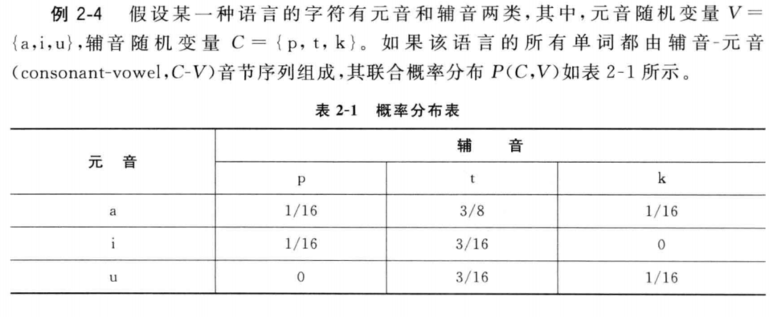
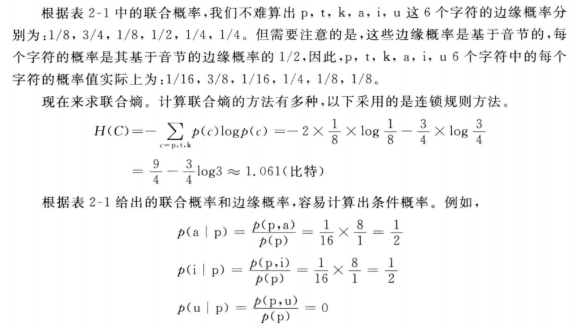
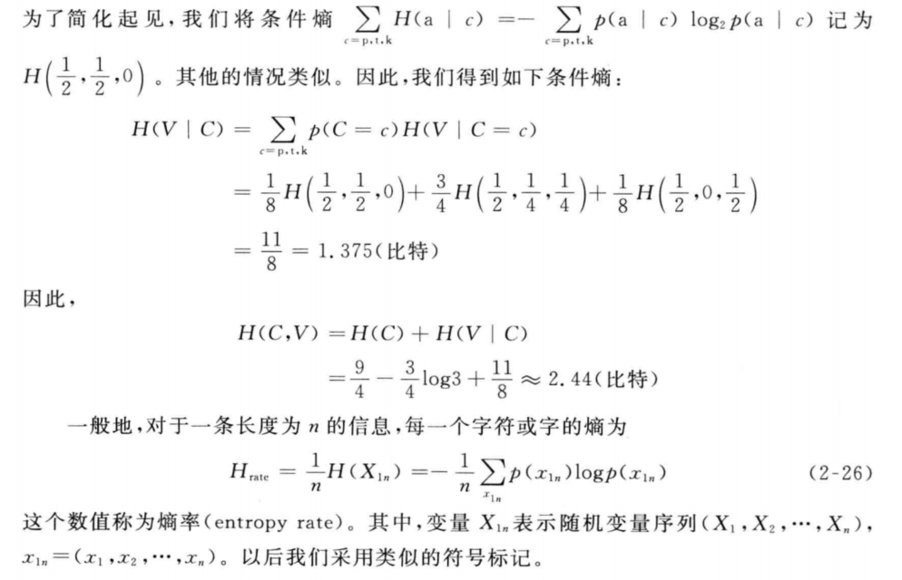
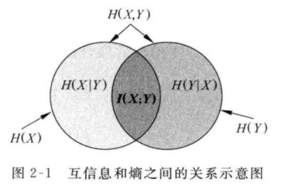

# 概率

**最大似然估计**

* 通常用相对频率作为概率的估计值，这种估计概率值得方法称为最大似然估计 

* 英文：maximum likelihood estimation  简称MLE

**条件概率**

$P(A | B)=\frac{P(A \cap B)}{P(B)}$

$P(A \cap B)=P(B) P(A | B)=P(A) P(B | A)$

$P(B | A)=\frac{P(B \cap A)}{P(A)}=\frac{P(A | B) P(B)}{P(A)}$

**贝叶斯法则**

$P(B, | A)=\frac{P\left(A | B_{j}\right) P\left(B_{j}\right)}{P(A)}=\frac{P\left(A | B_{j}\right) P\left(B_{j}\right)}{\sum_{i=1}^{n} P\left(A | B_{i}\right) P\left(B_{i}\right)}$

**二次项分布**

$p_{i}=\left(\begin{array}{c}{n} \\ {i}\end{array}\right) p^{i}(1-p)^{n-i}, \quad i=0,1, \cdots, n$

二项式分布式最重要的离散型概率分布之一，在自然语言中，一般以句子为处理单位，为了简化问题的复杂性，通常假设一个句子的出现独立于它前面的其它语句，句子的概率分布近似地被认为符合二项式分布

**信息熵**

熵：$H(X)=-\sum_{x \in \mathbb{R}} p(x) \log _{2} p(x)$

熵的单位是二进制位即比特，通常将$\log _{2} p(x)$写成$ \log  p(x)$

举例说明：

假如 a,b,c,d,e,f 6个字符在某一简单的语言中随机出现，每个字符出现的概率为：1/8,1/4,1/8,1/4,1/8,1/8,那么每个字符的熵为

$\begin{aligned} H(P) &=-\sum_{x \in\{a, b . c, d . e ., P} P(x) \log P(x)  &=-\left[4 \times \frac{1}{8} \log \frac{1}{8}+2 \times \frac{1}{4} \log \frac{1}{4}\right]=2 \frac{1}{2} \end{aligned} $ 比特

互信息越大，表示两个汉字之间的集合越紧密，越可能成词，反之，断开的可能性越大

两个随机变量的互信息不可能为负值，但是两个单个离散事件为点式互信息 point-wise mutual information有可能为负值，所以在判断两个连续汉字之间的结合强度方面，双字耦合度更合适

**最大熵**

最大熵应用在nlp中，通常的做法是根据已知样本设计特征函数，假设存在k个特征函数$f_i(i=1.2.3...k)$它们都在建模过程中对输出有影响，那么所建立的模型应满足所有这些特征的约束，即所建立的模型p应该属于这k个特征函数约束下所产生的所有模型的集合C

**联合熵和条件熵**

联合熵（joint entropy）：$H(X, Y)=-\sum_{x \in X} \sum_{y \in Y} p(x, y) \log p(x, y)$

联合熵就是描述一对随机变量平均所需要的信息量

给定随机变量X额情况下，随机变量Y的条件熵（conditional entropy）

$\begin{aligned} H(Y | X) &=\sum_{x \in X} p(x) H(Y | X=x) \\ &=\sum_{x \in X} p(x)\left[-\sum_{y \in Y} p(y | x) \log p(y | x)\right] \\ &=-\sum_{x \in X} \sum_{y \in Y} p(x, y) \log p(y | x) \end{aligned}$

将联合概率log p(x,y)展开得：

$\begin{aligned} H(X, Y) &=-\sum_{x \in X} \sum_{y \in Y} p(x, y) \log [p(x) p(y | x)] \\ &=-\sum_{x \in X} \sum_{y \in Y} p(x, y)[\log p(x)+\log p(y | x)] \\ &=-\sum_{x \in X} \sum_{y \in Y} p(x, y) \log p(x)-\sum_{x \in X} \sum_{y \in Y} p(x, y) \log p(y | x) \\ &=-\sum_{x \in X} p(x) \log p(x)-\sum_{x \in X} \sum_{y \in Y} p(x, y) \log p(y | x) \\ &=H(X)+H(Y | X) \end{aligned}$

举例说明

一般的对于一条长度为n的信息，每一个字符或者字的熵为：$H_{\mathrm{rate}}=\frac{1}{n} H\left(X_{1 n}\right)=-\frac{1}{n} \sum_{x_{1 n}} p\left(x_{1 n}\right) \log p\left(x_{1 n}\right)$

这个数值称为熵率（entropy rate) 

 

**互信息**

根据熵的连锁规则：

$H(X, Y)=H(X)+H(Y | X)=H(Y)+H(X | Y)$

所以：

$H(X)-H(X | Y)=H(Y)-H(Y | X)$

这个差叫做X和Y的互信息（mutual information，MI），写作$I(X ; Y)$，所以X,Y之间的互信息为$I(X ; Y)=H(X)-H(X | Y)$

$\begin{aligned} I(X ; Y) &=H(X)-H(X | Y) \\ &=H(X)+H(Y)-H(X, Y) \\ &=\sum_{x} p(x) \log \frac{1}{p(x)}+\sum_{y} p(y) \log \frac{1}{p(y)}+\sum_{x, y} p(x, y) \log p(x, y) \\ &=\sum_{x, y} p(x, y) \log \frac{p(x, y)}{p(x) p(y)} \end{aligned}$

由于H(X|X) = 0，所以$H(X)=H(X)-H(X | X)=I(X ; X)$

说明了熵为什么又称为自信息，另一方面说明了两个完全相互依赖的变量之间的互信息并不是一个常量，而是取决于他们的熵

**互信息的意义**

* 互信息大于0，表示X和Y是高度相关的
* =0，相互独立
* <0  表明Y的出现不但未使X的不确定性减小，反而增大了X的不确定性，常是不利的
* 平均互信息量是非负的
* 互信息在词汇聚类，汉语自动分词，词义消歧等问题有重要的应用

**相对熵**

​	相对熵(relative entropy )   又称KL散度 (Kullback -Leibler divergence) 是衡量相同事件空间里两个概率分布相对差距的测度。两个概率分布p(x)和q(x)的相对熵定义为

$D(p \| q)=\sum_{x \in X} p(x) \log \frac{p(x)}{q(x)}$

当两个随机分布完全相同时，相对熵为0

互信息实际上就是衡量一个联合分布与独立性差距多大的测度

$\begin{aligned} I(X ; Y) &=H(X)-H(X | Y) \\ &=-\sum_{x \in X} p(x) \log p(x)+\sum_{x \in X} \sum_{y \in Y} p(x, y) \log p(x | y) \\ &=\sum_{x \in X} \sum_{y \in Y} p(x, y) \log \frac{p(x | y)}{p(x)} \\ &=\sum_{x \in X} \sum_{y \in Y} p(x, y) \log \frac{p(x, y)}{p(x) p(y)} \\ &=D(p(x, y) \| p(x) p(y)) \end{aligned}$

**交叉熵**

用来衡量估计模型与真实概率分布之间的差异

$\begin{aligned} H(X, q) &=H(X)+D(p \| q) \\ &=-\sum_{x} p(x) \log q(x) \\ &=E_{p}\left(\log \frac{1}{q(x)}\right) \end{aligned}$

**SVM 支持向量机 **support vector machine

**支持向量机，因其英文名为support vector machine，故一般简称SVM**,其基本模型定义为特征空间上的间隔最大的线性分类器，其学习策略便是间隔最大化，最终可转化为一个凸二次规划问题的求解。

**svm是在logistic的基础上来的，lr可以分割样本，产生超平面，但是不一定是最好的超平面，如何找到一个间隔最大的超平面，所以才有了支持向量机**

**线性分类器:**

给定一些数据点，它们分别属于两个不同的类，现在要找到一个线性分类器把这些数据分成两类。如果用x表示数据点，用y表示类别（y=1或者y=−1，分别代表两个不同的类），一个线性分类器的学习目标便是要在n维的数据空间中找到一个超平面（hyper plane），这个超平面的方程可以表示为：

$w^Tx+b=0$

**给Logistic回归做一个变形。首先，将使用的结果标签y=0和y=1替换为y=−1,y=1然后把$\theta_0$替换成b，把w替换$\theta _i$,所以就变换为：**

$h_\theta(x)=g(w^Tx+b)$

**所以我们就可以假设函数：**$ h_\theta(x)=g(w^Tx+b)$   **中的g(z)做一个简化，将其简单映射到y=-1和y=1上。映射关系如下：**

$g(z)=\left\lbrace  \begin{aligned} 1 && z \ge0 \\ -1 && z<0 \end{aligned} \right.$

这个超平面可以用分类函数$f(x)=w^Tx+b$来表示，当f(x)等于0时候，x便是位于超平面上的点，而f(x)大于0的点对应y=1的数据点，f(x)小于0的点对应y=-1的点

**超平面用线性方程来描述：**

$w^T + b = 0$

**函数间隔:**

在超平面$w^T + b = 0$ 确定的情况下，$|w^T + b |$表示点距离超平面的距离，而超平面作为二分类器，如果$w^T + b >0$ 判定类别y为1，否则判定为-1，从而引出函数间隔的定义:

$r=y(w^Tx+b)=yf(x)$ 

**同符号相乘保证为结果为正,就是预测正确**

其中y是训练数据的类标记值， 如果$w^T + b >0$说明，预测的值和标记的值相同， 分类正确，而且值越大，说明点离平面越远，分类的可靠程度更高。这是对单个样本的函数定义， 对整个样本集来说，要找到所有样本中间隔值最小的作为整个集合的函数间隔：

$r=min \   r_i  , i=1,2 \cdot \cdot \cdot n$

**重点：**

**即w和b同时缩小或放大M倍后，超平面并没有变化，但是函数间隔跟着w和b变化。**

**所以，需要加入约束条件使得函数间隔固定, 也就是几何间隔。**

拿到分隔平面之后，就是固定平面的同时，又想w最小，才会产生二次凸优化问题

**几何间隔：**

样本空间x到超平面x0的距离：

$r=\frac{|w^Tx+b|}{||w||}$

如果超平面将样本成功分类，若 yi=+1,则有$w^T + b > 0$;若$y_i = -1$,则有 $w^Tx + b< 0$;则下式成立

$\left \lbrace \begin{aligned} w^Tx+b \ge+1&& y_i=+1 \\ w^Tx+b\le-1 && y_i=-1 \end{aligned} \right.$

**两个异类支持向量到超平面的距离之和，被称为间隔：**

$r = \frac{2}{||w||}$

我们要找的就是"最大间隔"的超平面

$max_{w,b}\frac{2}{||w||}$ 

$s.t.y_i(w^Tx+b)\ge1, i=1,2,\cdot \cdot \cdot m$    约束条件

**svm的二次凸函数和约束条件**

求最大的$\frac{1}{||w||}$ 相当于 $min_{w,b} \frac{1}{2}||w||^2$,这样原来的问题就转换为二次凸函数优化问题，在一定的约束条件下，目标最优，损失最小

**先从等式约束初识拉格朗日：**

**拉格朗日函数**：

- $L(x,y,\lambda) = f(x,y) + \lambda g(x,y)$	
- 其中 λ 是拉格朗日乘子

做出 f(x,y)  和  g(x,y) 的等高线（三维图形投影到二维平面后的结果）

**函数的梯度**：表示该函数在某点处的方向导数，方向导数是某个多维函数上的点沿每个维度分别求导后，再组合而成的向量：$\nabla_{x,y} f = (\frac{\partial{f}}{\partial{x}}, \frac{\partial{f}}{\partial{y}})$

$\nabla_{x,y} g = (\frac{\partial{g}}{\partial{x}}, \frac{\partial{g}}{\partial{y}})$

一个**函数的梯度与它的等高线垂直**

因此，在红点处，f(x∗,y∗) 的梯度与f(x,y)=d2 在(x∗，y∗) 处的切线垂直，g(x∗,y∗) 的梯度与g(x,y)=0 在 (x∗，y∗)处的切线垂直。

又因为f(x,y)=d2 对应的蓝线与g(x,y)=0 对应的绿线在(x∗，y∗) 处是相切的。

**在 (x∗,y∗) 点处 f(x,y) 与 g(x,y) 的梯度，要么方向相同，要么方向相反。**

所以，一定存在 λ≠0， 使得：

$\nabla_{x,y}f(x^*,y^*) + \lambda \nabla_{x,y}g(x^*,y^*) = 0$

这时我们将 **λ 称为拉格朗日乘子**！

**定义拉格朗日函数**：$L(x,y,\lambda) = f(x,y) + \lambda g(x,y)$

其中 λ 是拉格朗日乘子

拉格朗日函数把原本的目标函数和其限制条件整合成了一个函数。

拉格朗日函数对 x,y 求偏导：

$L'_{x,y}(x,y,\lambda) =f'_{x,y}(x,y) + \lambda g'_{x,y}(x,y)$

我们令拉格朗日函数对 x,y 求偏导的结果为 0，则有:

$f'_{x,y}(x,y) + \lambda g'_{x,y}(x,y) = 0$

**KKT约束条件：**

1. 如果严格不等式成立时得到 f(⋅)函数的极小值，则有 λ=0，这样才能将拉格朗日函数直接转换为原始函数。则有 λg(x,y)=0。
2. 如果等式成立时得到 f(⋅) 函数的约束条件极小值，则必然存在 λ>0，且同时 g(x,y)=0, 因此也有 λg(x,y)=0。

于是，对于不等式约束条件 g(x,y)⩽0，最终的约束条件变成了：

- g(x,y)⩽0;
- λ⩾0;
- λg(x,y)=0

这样由1变3的约束条件，叫做 **KKT 约束条件**。

针对于在 d 维空间上有 m 个等式约束条件和 n 个不等式约束条件的极小化问题

引入拉格朗日乘子 :

$\lambda = (\lambda_1, \lambda_2, …, \lambda_m)^T$

$\mu = (\mu_1, \mu_2, …, \mu_n)^T$

构造拉格朗日函数：

$L(x,\lambda,\mu) = f(x) + \sum_{i=1}^{m}\lambda_ih_i(x) + \sum_{j=1}^{n}\mu_jg_j(x)$

**拉格朗日构建方程**

由于这个问题的特殊结构，还可以通过**拉格朗日对偶性（Lagrange Duality）**变换到**对偶变量(dual variable)**的优化问题，即通过求解与原问题等价的**对偶问题（dual problem）**得到原始问题的最优解，这就是线性可分条件下支持向量机的对偶算法。

**优点**：

- 1、对偶问题往往更容易求解
- 2、可以自然的引入核函数

进而推广到非线性分类问题，具体来说就是svm基本型的每条约束添加拉格朗日乘子ai≥0,则该问题的拉格朗日函数可写为：

$L(w,b,a)= \frac12 ||w||^2+\sum_{i=1}^na_i(1-y_i(w^Tx+b))$

$a_i=(a_1;a_2; \cdot \cdot \cdot a_m)$

**注意：条件：$1-y_i(w^Tx+b) <= 0$**

我们的目标是让拉格朗如函数L(ω,b,α) 针对 α 达到最大值。为什么能够这么写呢，我们可以这样想，哪怕有一个 $yi(ω^Tx_i+b)⩾1$不满足，只要让对应的 αi 是正无穷就好了。所以，如果 L(ω,b,α)有有限的最大值，那么那些不等式条件是自然满足的。 之后，我们再让  L(ω,b,α) 针对  ω,b 达到最小值，就可以了。 从而，我们的目标函数变成：

**原问题是极小极大问题：**

$min_{w,b}max_aL(w,b,a)=p^*$

**原始问题的对偶问题，是极大极小问题：**

$max_amin_{w,b}L(w,b,a)=b^*$

交换以后的新问题是原始问题的对偶问题，这个新问题的最优值用 d∗来表示。而且有$d^∗⩽p^∗$，在满足某些条件的情况下，这两者相等，这个时候就可以通过求解对偶问题来间接地求解原始问题。

$\left\lbrace\ \begin{aligned} a_i \ge0 \\ y_i(w^Tx_i+b) -1\ge 0 \\ a_i(y_i(w^Tx_i+b)-1)=0 \end{aligned} \right.$

**KKT条件的意义：它是一个非线性规划（Nonlinear Programming）问题能有最优化解法的必要和充分条件**

原始问题通过满足KKT条件，已经转化成了对偶问题。而求解这个对偶学习问题，分为3个步骤：

- 首先要让L(w，b，a) 关于w和b最小化
- 然后求对a的极大
- 最后利用SMO算法求解对偶问题中的拉格朗日乘子

**对偶问题求解**

**首先**固定$a$,先求出$min_{w,b}L(w,b,a))$,所以分别对w,b进行求偏导并令其等于0。

$\frac{\partial L(w,b,a)}{\partial w}=\frac{\partial(\frac12w^Tw+\sum_{i=1}^na_i-\sum_{i=1}^n a_iby_i-\sum_{i=1}^n a_iy_iw^Tx)}{\partial w}  =0$

$\frac{\partial L(w,b,a)}{\partial b}=\frac{\partial(\frac12w^Tw+\sum_{i=1}^na_i-\sum_{i=1}^n a_iby_i-\sum_{i=1}^n a_iy_iw^Tx)}{\partial b}  =0$

得到：

$w = \sum_{i=1}^na_i x_i y_i$

$\sum_{i=1}^na_iy_i=0$

然后我们将以上结果带入原式**L(w,b,a)**:

$L(w,b,a)= \frac12 ||w||^2+\sum_{i=1}^na_i(1-y_i(w^Tx+b))$

$=\frac12w^Tw+\sum_{i=1}^na_i-\sum_{i=1}^n a_iby_i-\sum_{i=1}^n a_iy_iw^Tx$

导入：$w=\sum_{i=1}^na_ix_iy_i$

转换为： $=\frac12w^T(\sum_{i=1}^na_ix_iy_i)+\sum_{i=1}^na_i-\sum_{i=1}^n a_iby_i-w^T(\sum_{i=1}^n a_iy_ix)$

再导入$\sum_{i=1}^na_iy_i=0$

$=\sum_{i=1}^na_i-\frac12w^T(\sum_{i=1}^na_ix_iy_i)$

$=\sum_{i=1}^na_i-\frac12{(\sum_{i=1}^na_ix_iy_i)}^T(\sum_{i=1}^na_ix_iy_i)$

$=\sum_{i=1}^na_i-\frac12(\sum_{i=1}^na_i{x_i}^Ty_i)(\sum_{i=1}^na_ix_iy_i)$

$=\sum_{i=1}^na_i-\frac12\sum_{i=1,j=1}^na_ia_j{x_i}^Tx_jy_iy_j$

**注意：上式是把两个求和合并一个表达式，所以有i，j**

从上面的最后一个式子，我们可以看出，此时的拉格朗日函数只包含了一个变量，那就是 $a_i$(求出了  $a_i$便能求出 w,b,然后我们的分类函数 $f(x)=w^Tx+b$就非常容易的求出来了)。

然后求对$\alpha$的极大值：

**重点**

**即是关于对偶问题的最优化问题。经过上面第一个步骤的求w和b，得到的拉格朗日函数式子已经没有了变量w，b**

只有从上面的式子得到：

$max_a \sum_{i=1}^na_i-\frac12\sum_{i=1,j=1}^na_ia_j{x_i}^Tx_jy_iy_j$

$s.t. ,a_i\ge0, i=1,\cdot \cdot \cdot n$

$\sum_{i=1}^na_iy_i=0$

一般使用SMO算法来求解$\alpha$

**为什么转化为拉格朗日对偶问题就可以求解？**

- 构建拉格朗日函数就是为了转移求解问题
- 因为极小极大问题无法直接求解，w,b并没有限制条件，同一个超平面，w，b可以成倍数变化
- 转化为极大极小问题，先求解拉格朗日乘子，拉格朗日乘子 $\lambda \geqslant 0$ 有限制条件
- 求出满足条件的拉格朗日乘子，然后根据偏导等于0算出 w，b

**SMO（Sequential Minimal Optimization）算法**

为什么会有smo算法，是为了简化求解过程

优化目标：

$T(\alpha_1, \alpha_2,...,\alpha_m) = \frac{1}{2}\sum_{i=1}^{m}\sum_{j=1}^{m}\alpha_i\alpha_jy_iy_j(x_i \cdot x_j) - \sum_{i=1}^{m}\alpha_i$

$min_\alpha T(\alpha_1, \alpha_2, ..., \alpha_m)$

$\alpha_i \geqslant 0, i =1,2,...,m$

一共有 m 个参数需优化。

这是一个典型的二次规划问题，我们可以直接用二次规划方法求解。或者，为了节约开销我们也可以用 SMO 算法。

SMO 是一种动态规划算法，它的**基本思想**非常简单：每次只优化一个参数，其他参数先固定住，仅求当前这一个优化参数的极值。

可惜，我们的优化目标有约束条件：$\sum(αiyi)=0$，其中i=1，2，…,m。如果我们一次只优化一个参数，就没法体现约束条件了。

于是，我们这样做：

**1.** 选择两个需要更新的变量 αi 和 αj，固定它们以外的其他变量。

这样，约束条件就变成了：

$\alpha_i y_i + \alpha_j y_j = c, \alpha_i \geqslant 0, \alpha_j \geqslant 0$

其中:

$c = - \sum_{k\ne i,j} \alpha_k y_k$

这样由此，可得出$\alpha_j = \frac{(c – \alpha_i y_i)}{y_j}$ ，也就是我们可以用  αi 的表达式代替 αj 。

将这个替代式带入优化目标函数。就相当于把目标问题转化成了一个单变量的二次规划问题，仅有的约束是  αi⩾0。

**2.** 对于仅有一个约束条件的最优化问题，我们完全可以在  αi 上，对问题函数  T(αi) 求（偏）导，令导数为零，从而求出变量值 $\alpha_{i_{new}}$，然后再根据 $\alpha_{i_{new}}$求出 $\alpha_{j{new}}$。

如此一来，αi 和 αj 就都被更新了。

**3.** 多次迭代上面1-2步， 直至收敛。

